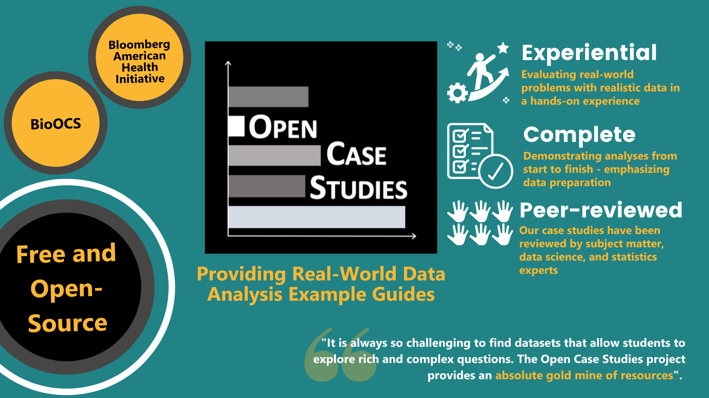

```{css, echo=FALSE}
html {
  scroll-behavior: smooth;
}

/* Section styling */
.section {
  min-height: 10vh;
  padding: 10px 20px;
  display: flex;
  flex-direction: column;
  justify-content: left;
  align-items: left;
}

.section-about {
  background: #f9f9f9;
}

.section-survey {
  background: #fff;
}

.section-blog {
  background: rgba(35, 138, 141, 0.05);
}

.section h2 {
  color: #238A8D;
  font-size: 3rem;
  margin-bottom: 10px;
}

.section-content {
  max-width: 900px;
  text-align: left;
}

/* Hero section */
.hero {
  min-height: 30vh;
  display: flex;
  flex-direction: column;
  justify-content: center;
  align-items: center;
  background: linear-gradient(135deg, #218386 0%, #218386 100%);
  color: white;
  text-align: center;
  padding: 10px 20px;
}

.hero h1 {
  font-size: 3.5rem;
  margin-bottom: 0px;
}

.hero p {
  font-size: 1.3rem;
  margin-bottom: 0px;
  opacity: 0.95;
}

.cta-button {
  display: inline-block;
  padding: 15px 30px;
  background: white;
  color: #238A8D;
  text-decoration: none;
  border-radius: 10px;
  font-weight: 600;
  margin: 10px;
  transition: transform 0.2s;
}

.cta-button:hover {
  transform: translateY(-3px);
  box-shadow: 0 4px 12px rgba(0,0,0,0.2);
}

```


<div class="hero">

<div>
<a href="search_new.html" class="cta-button">Browse case studies</a>
</div>
</div>

<div id="about" class="section section-about">
<div class="section-content">

## What is the Open Case Studies (OCS) project?

The Open Case Studies project is an educational resource of experiential guides that demonstrate how to effectively derive knowledge from data in real-world challenges.

<!--  -->

Our case studies can be used by:

:::: {style="display: flex; justify-content: space-between;"}

::: {style="width: 30%;"}
`r fontawesome::fa("chalkboard-user", fill = "#238A8D", height = "1.4em", width = "1.4em", margin_right = "0.35em", title = "Instructor", a11y = "sem")` **Educators** to help them teach  
:::

::: {style="width: 30%;"}
`r fontawesome::fa("graduation-cap", fill = "#238A8D", height = "1.4em", width = "1.4em", margin_right = "0.35em", title = "Cap and gown", a11y = "sem")` **Students** to help them with their classes 
:::

::: {style="width: 30%;"}
 
`r fontawesome::fa("brain", fill = "#238A8D", height = "1.4em", width = "1.4em", margin_right = "0.35em", title = "Someone thinking", a11y = "sem")` **Independent learners** to help them learn
:::

::::


Find out more about how others are using case studies and what they think of them in this
[study](http://jhir.library.jhu.edu/handle/1774.2/66820).

</div>
</div>

<div style="display: grid; grid-template-columns: repeat(3, 1fr); gap: 12px; margin: 10px 20px; text-align: center;">

<div style="background-color: #fee1b9; olor: black; padding: 15px 20px; border-radius: 6px; border: 1.5px solid #8ab58a;">
<strong>Learn how to use our case studies in our guide:</strong><br>
<a href="https://www.opencasestudies.org/OCS_Guide" style="color: black;" target="_blank">Website version</a> &nbsp;|&nbsp;
<a href="https://leanpub.com/opencasestudies_guide" style="color: black;" target="_blank">PDF version and more</a>
</div>

<div style="background-color: #fbb731; color: black; padding: 15px 20px; border-radius: 6px; border: 1.5px solid #8ab58a;">
<strong>Read our publication about the OCS project:</strong><br>
<a href="https://www.tandfonline.com/doi/full/10.1080/26939169.2024.2394541" style="color: black; text-decoration: underline;" target="_blank" rel="noopener">Open Case Studies: Statistics and Data Science Education through Real-World Applications</a>
</div>

<div style="background-color: #fdd398; color: black; padding: 15px 20px; border-radius: 6px; border: 1.5px solid #8ab58a;">
<strong>Learn more about the OCS project:</strong><br>
<a href="https://jscholarship.library.jhu.edu/items/69ae8990-a78b-4d53-916e-d2a279afd69b" style="color: black; text-decoration: underline;" target="_blank" rel="noopener">Find out more about how others are using case studies and what they think of them.</a>
</div>

</div>

<div style="background-color: #F9F9ED; color: black; padding: 15px 20px; border-radius: 6px; margin: 10px 20px; border: 1.5px solid black; text-align: left;">
Our case studies cover many concepts!<br>
<strong>Statistical topics:</strong> from correlation to the influence of multicollinearity on linear regression<br>
<strong>Data science topics:</strong> from making simple plots to building dashboards and performing machine learning (ML), a type of artificial intelligence (AI)!
</div>


## What problem are we addressing?

Despite unprecedented and growing interest in data science on campuses, there are few courses and course materials that provide meaningful opportunity for students to learn about real-world challenges. Most courses frequently fail to frame the lectures around a real-world application and provide unrealistically clean datasets that fit the assumptions of the methods in an unrealistic way. The result is that students are left unable to effectively analyze data and solve real-world challenges outside of the classroom.

<!-- ## Problems with previously suggested solutions -->

<!-- In 1999, [Nolan and Speed](https://www.stat.berkeley.edu/users/statlabs/) argued the solution was to teach courses through in-depth case studies derived from interesting problems, with nontrivial solutions that leave room for different analyses. This innovative framework teaches the student to make important connections between the scientific question, data and statistical concepts that only come from hands-on experience analyzing data. However, these case studies based on realistic challenges, not toy examples, are scarce. -->

<!-- ## What are we proposing as a solution? -->

<!-- To address this, we are developing the **Open Case Studies** educational resource of case studies, which demonstrate illustrative data analyses that can be used in the classroom to teach students how to effectively derive knowledge from data. This approach has successfully been used to -->
<!-- [teach data science](https://amstat.tandfonline.com/doi/abs/10.1080/00031305.2017.1356747#.XDZCzS3MxTY) -->
<!-- courses at many universities, including: -->

<!-- * [Johns Hopkins Bloomberg School of Public Health](https://jhu-advdatasci.github.io/2018/) -->
<!-- * [Harvard University](http://cs109.github.io/2014/) -->
<!-- * [Harvard T.H. Chan School of Public Health](http://datasciencelabs.github.io/2016/) -->
<!-- * [University of California at Berkeley](http://rdatasciencecases.org) -->
<!-- * [Smith College](https://www.tandfonline.com/doi/pdf/10.1080/00031305.2015.1081105) -->

```{=html}
<div class="video-wrap">
  <iframe
    src="https://www.youtube.com/embed/DgzBSOY5Yc8"
    title="Open Case Studies video"
    frameborder="0"
    allow="accelerometer; autoplay; clipboard-write; encrypted-media; gyroscope; picture-in-picture; web-share"
    allowfullscreen>
  </iframe>
</div>
```

<div id="publications" class="section" style="background: #fff;">
<div class="section-content">


## Our Projects

<p style="color: #555; font-size: 1.4rem; line-height: 1.7; margin: 0 0 10px 0;">Open Case Studies spans two complementary project areas, each grounded in real-world data and designed for hands-on learning. Through these projects, learners gain experience with data wrangling, visualization, and statistical analysis using R — applied to pressing challenges in public health and the biomedical sciences. Each case study is freely available and built to be used in the classroom or independently.</p>

<div style="display: grid; grid-template-columns: repeat(auto-fit, minmax(280px, 1fr)); gap: 24px; margin: -rpx 0;">

<div style="border-left: 4px solid #003366; padding: 12px 20px; margin: 16px 0; background: #f9f9f9; border-radius: 0 6px 6px 0;">
<h3 style="color: #003366; margin: 0 0 10px 0;">Bloomberg American Health Case Studies</h3>
<p style="color: #555; line-height: 1.6; margin: 0 0 16px 0;">Open case studies on public health topics, developed in partnership with the Bloomberg American Health Initiative at Johns Hopkins.</p>
<a href="bloomberg.html" style="color: #003366; font-weight: 600; text-decoration: none;">Learn more →</a>
</div>

<div style="border-left: 4px solid #1a7a4a; padding: 12px 20px; margin: 16px 0; background: #f9f9f9; border-radius: 0 6px 6px 0;">
<h3 style="color: #1a7a4a; margin: 0 0 10px 0;">BioOCS</h3>
<p style="color: #555; line-height: 1.6; margin: 0 0 16px 0;">Open case studies for the biomedical sciences, bringing real-world quantitative biology education to students, instructors, and independent learners.</p>
<a href="bioocs.html" style="color: #1a7a4a; font-weight: 600; text-decoration: none;">Learn more →</a>
</div>

</div>

</div>
</div>

<div id="survey" class="section section-survey">
<div class="section-content">


```{r, child='search_new.Rmd'}
```

## Highlighted Publication

<div style="border-left: 6px solid #fbb731; padding: 16px 20px; margin: 16px 0; background: #fbb731; border-radius: 0 6px 6px 0;">

<div style="font-size: 1.2rem; font-weight: 600; margin-bottom: 6px; color: #000;">
Carrie Wright, Qier Meng, Michael R. Breshock, Lyla Atta, Margaret A. Taub, Leah R. Jager, John Muschelli &amp; Stephanie C. Hicks
</div>

<div style="margin-bottom: 6px; font-size: 2rem;">
<a href="https://www.tandfonline.com/doi/full/10.1080/26939169.2024.2394541" target="_blank" rel="noopener" style="color: #000; text-decoration: none; font-weight: 700;">
Open Case Studies: Statistics and Data Science Education through Real-World Applications
</a>

<a href="https://www.tandfonline.com/doi/full/10.1080/26939169.2024.2394541" target="_blank" rel="noopener" style="color: #000; text-decoration: none; font-weight: 300; font-size: 1.3rem;"> https://www.tandfonline.com/doi/full/10.1080/26939169.2024.2394541
</a>
</div>

<div style="font-size: 1rem; color: #000;"><em>Journal of Statistics and Data Science Education</em>, Pages 331–344. Published online: 24 Sep 2024.</div>
</div>

</div>
</div>


<div id="projects" class="section" style="background: #fff;">
<div class="section-content">

## Latest from Our Blog
```{r latest-posts, echo=FALSE, results='asis'}
# Get 3 most recent posts
post_files <- list.files("post", pattern = "\\.Rmd$", full.names = TRUE)

# Extract metadata function (simplified version)
extract_metadata <- function(file) {
  lines <- readLines(file, warn = FALSE)
  yaml_start <- which(lines == "---")[1]
  yaml_end <- which(lines == "---")[2]
  
  if (is.na(yaml_start) || is.na(yaml_end)) return(NULL)
  
  yaml_lines <- lines[(yaml_start + 1):(yaml_end - 1)]
  
  # Extract title and date
  title_line <- yaml_lines[grep("^title:", yaml_lines)]
  title <- if (length(title_line) > 0) {
    gsub("title:\\s*['\"]?|['\"]?$", "", title_line[1])
  } else "Untitled"
  
  date_line <- yaml_lines[grep("^date:", yaml_lines)]
  date <- if (length(date_line) > 0) {
    gsub("date:\\s*['\"]?|['\"]?$", "", date_line[1])
  } else "No date"
  
  html_file <- paste0("post/", gsub("\\.Rmd$", ".html", basename(file)))
  
  list(
    title = title,
    date = date,
    file = html_file,
    sort_date = tryCatch(as.Date(date), error = function(e) Sys.Date())
  )
}

# Get posts
posts <- lapply(post_files, extract_metadata)
posts <- posts[!sapply(posts, is.null)]
posts <- posts[order(sapply(posts, function(x) x$sort_date), decreasing = TRUE)]

# Show top 3
posts <- head(posts, 3)

cat('<div style="display: grid; grid-template-columns: repeat(auto-fit, minmax(250px, 1fr)); gap: 20px; margin: 30px 0;">\n')

for (post in posts) {
  cat(sprintf('
<div class="post-card">
<h3><a href="%s">%s</a></h3>
<div class="post-date">%s</div>
</div>
  ', post$file, post$title, post$date))
}

cat('</div>\n')
```

<a href="blog.html" class="btn-primary">View All Posts →</a>

</div>
</div>
